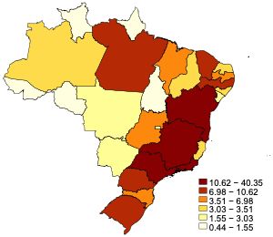

# brazil_maptile
This folder contains Brazilian geofiles that can be used with the [_maptile_](https://michaelstepner.com/maptile/) Stata program by Michael Stepner.


# State-level maps
To install the state-level (UF) file, type 
```
maptile_install using "https://skestelman.github.io/code/brazil_uf_maptile.zip"
```

__Example output__




# Municipality-level maps
To install the municipality (município) file, type 
```
maptile_install using "https://skestelman.github.io/code/brazil_muni2019_maptile.zip"
```
(The municipalities one is too big for GitHub)

# Arranjo-level maps 
Arranjos are Brazilian metropolitan areas. To install the arranjos file, type 
```
maptile_install using "https://skestelman.github.io/code/brazil_arranjo_maptile.zip"
```

# Microregion maps 
To install the microregions file, type 
```
maptile_install using "https://skestelman.github.io/code/brazil_microregion_maptile.zip"
```

Thanks to [_Diana Goldemberg_](https://github.com/dianagold) for her help.
